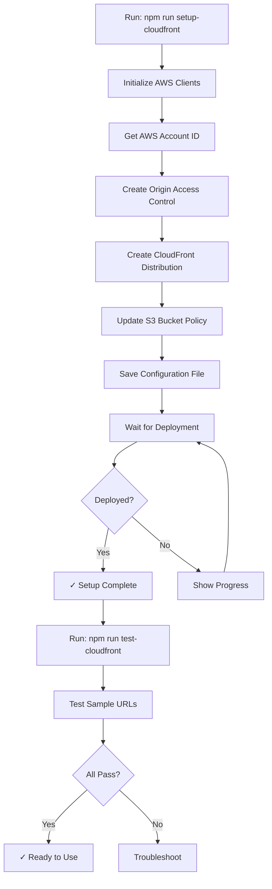

# CloudFront CDN Implementation Summary

## Implementation Complete ✅

A complete CloudFront setup automation has been implemented to serve your migrated S3 images.

---

## What Was Built

### 1. Automated CloudFront Setup Script (`scripts/setup-cloudfront.js`)

**Features**:
- ✅ Creates Origin Access Control (OAC) for secure S3 access
- ✅ Creates CloudFront distribution with optimal caching settings
- ✅ Configures S3 bucket policy automatically
- ✅ Uses managed policies (CachingOptimized, CORS-S3Origin, SimpleCORS)
- ✅ Enables HTTPS redirect and compression
- ✅ Saves configuration to JSON file
- ✅ Optionally waits for deployment (15-20 min)
- ✅ Provides clear usage instructions

**What it configures**:
| Component | Configuration |
|-----------|---------------|
| **Origin** | S3 bucket with OAC (private bucket access) |
| **Caching** | CachingOptimized (24h TTL, optimized for images) |
| **Security** | HTTPS only, OAC signed requests |
| **CORS** | SimpleCORS headers for browser compatibility |
| **Compression** | Gzip/Brotli enabled |
| **Price Class** | North America + Europe (cost optimized) |

---

### 2. CloudFront Test Script (`scripts/test-cloudfront.js`)

**Features**:
- ✅ Loads CloudFront configuration from saved file
- ✅ Retrieves sample images from S3
- ✅ Tests multiple URLs through CloudFront
- ✅ Reports cache status (Hit/Miss)
- ✅ Validates response codes and headers
- ✅ Provides detailed test summary

**Test Output**:
```
✓ Loaded config for: d1a2b3c4d5e6f7.cloudfront.net
✓ Found 5 sample images

Testing CloudFront URLs...
  [1/5] Testing: lotimages/3483/1713553344/i0178-1.jpg
    ✓ SUCCESS
      Status: 200
      Cache: Miss from cloudfront
      Type: image/jpeg
      Size: 45678 bytes

Test Summary:
  Total Tests: 5
  Passed: 5
  Failed: 0
  Cache Hits: 4
  Cache Misses: 1
```

---

### 3. Comprehensive Documentation

**Created Files**:
1. **`CLOUDFRONT_QUICKSTART.md`** - Fast-track setup guide
   - 3-step setup process
   - Integration examples
   - Troubleshooting guide

2. **`docs/CLOUDFRONT_SETUP.md`** - Detailed reference
   - Manual setup instructions
   - All configuration options
   - Cost analysis
   - Security best practices
   - Monitoring & analytics
   - Advanced features

3. **`docs/CLOUDFRONT_IMPLEMENTATION.md`** - This file
   - Technical architecture
   - Implementation details
   - Testing strategy

---

### 4. NPM Scripts Added

```json
{
  "scripts": {
    "setup-cloudfront": "node scripts/setup-cloudfront.js",
    "test-cloudfront": "node scripts/test-cloudfront.js"
  }
}
```

---

### 5. Dependencies Added

```json
{
  "dependencies": {
    "@aws-sdk/client-cloudfront": "^3.679.0",
    "@aws-sdk/client-sts": "^3.679.0"
  }
}
```

---

## Architecture

### Complete Data Flow

```
┌──────────────────┐
│  Old CloudFront  │  d278yjzsv5tla9.cloudfront.net
│  (Source)        │  /auctionimages/{id}/{ts}/{file}
└────────┬─────────┘
         │
         │ Migration Script
         ▼
┌──────────────────┐
│  S3 Bucket       │  west-auction-images (us-west-2)
│  (Storage)       │  /lotimages/{id}/{ts}/{file}
└────────┬─────────┘
         │
         │ Origin Access Control (OAC)
         ▼
┌──────────────────┐
│  New CloudFront  │  YOUR-ID.cloudfront.net
│  (CDN)           │  /lotimages/{id}/{ts}/{file}
└──────────────────┘
         │
         │ HTTPS + Cache
         ▼
┌──────────────────┐
│  End Users       │  Browsers, Apps
└──────────────────┘
```

### Security Model

```
┌─────────────┐
│ End User    │
└──────┬──────┘
       │ HTTPS (TLS 1.2+)
       ▼
┌─────────────────────────────────┐
│ CloudFront Edge Locations       │
│ (Cached, Global)                │
└──────┬──────────────────────────┘
       │ Signed Request (OAC)
       │ AWS SigV4
       ▼
┌─────────────────────────────────┐
│ S3 Bucket (Private)             │
│ Only CloudFront can access      │
└─────────────────────────────────┘
```

**Benefits**:
1. S3 bucket remains private (no public access)
2. CloudFront signs all requests to S3
3. HTTPS enforced for all client connections
4. No direct S3 URLs possible

---

## URL Transformation

### From Old CloudFront
```
https://d278yjzsv5tla9.cloudfront.net/auctionimages/3483/1713553344/i0178-1.jpg
       └───────────────────────┘    └──────────┘
       Old domain                   Old prefix
```

### To S3 (Migration)
```
s3://west-auction-images/lotimages/3483/1713553344/i0178-1.jpg
                         └────────┘
                         New prefix
```

### To New CloudFront
```
https://d1a2b3c4d5e6f7.cloudfront.net/lotimages/3483/1713553344/i0178-1.jpg
       └────────────────────────┘   └────────┘
       New domain                   Same prefix
```

**Key Points**:
- ✅ Prefix changed: `auctionimages` → `lotimages`
- ✅ Structure preserved: `{auctionId}/{timestamp}/{filename}`
- ✅ Direct 1:1 URL mapping possible
- ✅ No complex URL rewriting needed

---

## Setup Process

### Automated Flow



### Manual Alternative

If automated setup fails, users can:
1. Follow `docs/CLOUDFRONT_SETUP.md` for AWS Console setup
2. Manually create OAC and distribution
3. Copy distribution ID to `data/cloudfront-config.json`

---

## Configuration Details

### CloudFront Distribution Settings

```javascript
{
  // Origin Configuration
  Origin: {
    DomainName: 'west-auction-images.s3.us-west-2.amazonaws.com',
    OriginAccessControlId: 'E4NPD8WXDV0U0', // Created by script
  },
  
  // Cache Behavior
  DefaultCacheBehavior: {
    ViewerProtocolPolicy: 'redirect-to-https',
    AllowedMethods: ['GET', 'HEAD'],
    Compress: true,
    
    // Managed Policies (AWS-maintained)
    CachePolicyId: '658327ea-f89d-4fab-a63d-7e88639e58f6',      // CachingOptimized
    OriginRequestPolicyId: '88a5eaf4-2fd4-4709-b370-b4c650ea3fcf', // CORS-S3Origin
    ResponseHeadersPolicyId: '60669652-455b-4ae9-85a4-c4c02393f86c', // SimpleCORS
  },
  
  // Geographic Distribution
  PriceClass: 'PriceClass_100', // North America + Europe
  
  // SSL/TLS
  ViewerCertificate: {
    CloudFrontDefaultCertificate: true,
    MinimumProtocolVersion: 'TLSv1.2_2021',
  },
}
```

### S3 Bucket Policy (Auto-Generated)

```json
{
  "Version": "2012-10-17",
  "Statement": [
    {
      "Sid": "AllowCloudFrontServicePrincipal",
      "Effect": "Allow",
      "Principal": {
        "Service": "cloudfront.amazonaws.com"
      },
      "Action": "s3:GetObject",
      "Resource": "arn:aws:s3:::west-auction-images/*",
      "Condition": {
        "StringEquals": {
          "AWS:SourceArn": "arn:aws:cloudfront::ACCOUNT-ID:distribution/DISTRIBUTION-ID"
        }
      }
    }
  ]
}
```

**Security Benefits**:
- Only CloudFront can access S3
- Distribution-specific access (not all CloudFront)
- No public bucket access needed

---

## Cache Strategy

### Cache Policies

**CachingOptimized** (chosen):
- TTL: 86400 seconds (24 hours)
- Max TTL: 31536000 seconds (1 year)
- Min TTL: 1 second
- Query strings: Ignored
- Headers: None forwarded
- Cookies: None forwarded

**Why this works for images**:
- Images are immutable (filename changes if content changes)
- Long cache times reduce S3 requests
- No query strings or cookies needed
- Lower costs, faster delivery

### Cache Behavior

```
First Request (Cache Miss):
Browser → CloudFront → S3 → CloudFront → Browser
         (fetch from origin)

Subsequent Requests (Cache Hit):
Browser → CloudFront → Browser
         (served from cache)
```

**Expected Cache Hit Rate**: 80-95%

---

## Performance Characteristics

### Expected Metrics

| Metric | Value | Notes |
|--------|-------|-------|
| **First Byte Time** | 50-200ms | From edge location |
| **Cache Hit Ratio** | 80-95% | After warm-up period |
| **Request Rate** | Unlimited | Auto-scales |
| **Bandwidth** | Up to 100 Gbps | Per edge location |

### Global Distribution

CloudFront has 450+ edge locations worldwide:
- North America: 175+
- Europe: 125+
- Asia: 90+
- South America: 30+
- Africa: 15+
- Oceania: 15+

**Result**: Images served from nearest edge location globally.

---

## Cost Analysis

### CloudFront Pricing (US East)

| Component | Price | 
|-----------|-------|
| **Data Transfer Out** | |
| First 10 TB/month | $0.085/GB |
| Next 40 TB/month | $0.080/GB |
| Next 100 TB/month | $0.060/GB |
| Over 150 TB/month | $0.040/GB |
| **HTTP Requests** | |
| First 10M/month | Free (then $0.0075/10K) |
| **HTTPS Requests** | |
| First 10M/month | Free (then $0.010/10K) |

### Usage Scenarios

**Low Traffic** (10GB, 1M requests/month):
```
Data Transfer:  10 GB × $0.085      = $0.85
Requests:       1M × $0            = $0.00 (free tier)
Total:                               $0.85/month
```

**Moderate Traffic** (100GB, 10M requests/month):
```
Data Transfer:  100 GB × $0.085     = $8.50
Requests:       10M × $0            = $0.00 (free tier)
Total:                               $8.50/month
```

**High Traffic** (1TB, 100M requests/month):
```
Data Transfer:  1000 GB × $0.085    = $85.00
Requests:       100M × $0.0075/10K  = $75.00
Total:                               $160.00/month
```

**Free Tier** (first 12 months):
- 1 TB data transfer out
- 10M HTTP/HTTPS requests

**Likely Cost**: $0-20/month for typical usage

---

## Monitoring & Observability

### CloudWatch Metrics

Automatically collected:
- `Requests` - Total requests
- `BytesDownloaded` - Data transfer
- `BytesUploaded` - Upload (usually 0 for GET-only)
- `TotalErrorRate` - 4xx + 5xx errors
- `4xxErrorRate` - Client errors
- `5xxErrorRate` - Server errors
- `CacheHitRate` - % served from cache

### Recommended Alarms

```javascript
// High Error Rate
{
  MetricName: 'TotalErrorRate',
  Threshold: 5, // %
  ComparisonOperator: 'GreaterThanThreshold',
  EvaluationPeriods: 2,
  Period: 300, // 5 minutes
}

// Low Cache Hit Rate
{
  MetricName: 'CacheHitRate',
  Threshold: 70, // %
  ComparisonOperator: 'LessThanThreshold',
  EvaluationPeriods: 3,
  Period: 300,
}
```

### Access Logs (Optional)

Enable CloudFront access logging:
```javascript
{
  Logging: {
    Enabled: true,
    IncludeCookies: false,
    Bucket: 'west-auction-logs.s3.amazonaws.com',
    Prefix: 'cloudfront/',
  }
}
```

**Log Fields**:
- Date, time, edge location
- Client IP, HTTP method, URI
- Status code, bytes sent
- Referrer, User-Agent
- Cache status (Hit, Miss, Error)

---

## Testing Strategy

### Phase 1: Automated Tests
```bash
npm run test-cloudfront
```

**Tests**:
1. ✓ Configuration file exists
2. ✓ S3 contains images
3. ✓ CloudFront returns 200 OK
4. ✓ Content-Type is correct
5. ✓ Cache headers present
6. ✓ Second request shows cache hit

### Phase 2: Manual Verification

**Browser Test**:
1. Open: `https://YOUR-DOMAIN/lotimages/3483/1713553344/i0178-1.jpg`
2. Check: Image displays correctly
3. Reload: Should be instant (cached)
4. DevTools: Check response headers

**curl Test**:
```bash
# First request (cache miss)
curl -I https://YOUR-DOMAIN/lotimages/3483/1713553344/i0178-1.jpg

# Look for:
# HTTP/2 200
# x-cache: Miss from cloudfront
# content-type: image/jpeg

# Second request (cache hit)
curl -I https://YOUR-DOMAIN/lotimages/3483/1713553344/i0178-1.jpg

# Look for:
# HTTP/2 200
# x-cache: Hit from cloudfront
# age: 42
```

### Phase 3: Load Test (Optional)

**Tools**:
- Apache Bench: `ab -n 1000 -c 10 <url>`
- k6: `k6 run load-test.js`

**Metrics to verify**:
- No 5xx errors under load
- Response time < 200ms
- Cache hit rate > 80%

---

## Migration Integration

### Update Migration Script (Future)

When migration completes, optionally update to use CloudFront for verification:

```javascript
// In migrate-images-to-s3.js

// After upload to S3
const s3Key = 'lotimages/3483/1713553344/i0178-1.jpg';
await uploadToS3(imageUrl, s3Key);

// Verify via CloudFront (optional)
const cfUrl = `https://${CLOUDFRONT_DOMAIN}/${s3Key}`;
const response = await fetch(cfUrl, { method: 'HEAD' });
if (!response.ok) {
  log(`Warning: CloudFront verification failed for ${s3Key}`);
}
```

---

## Application Integration

### Before (Old CloudFront)

```javascript
// Current code using old CloudFront
const CLOUDFRONT_DOMAIN = 'd278yjzsv5tla9.cloudfront.net';
const imageUrl = `https://${CLOUDFRONT_DOMAIN}/auctionimages/${auctionId}/${timestamp}/${filename}`;
```

### After (New CloudFront)

```javascript
// Updated code using new CloudFront
const CLOUDFRONT_DOMAIN = 'd1a2b3c4d5e6f7.cloudfront.net'; // From cloudfront-config.json
const imageUrl = `https://${CLOUDFRONT_DOMAIN}/lotimages/${auctionId}/${timestamp}/${filename}`;
```

### Environment Variables

```bash
# .env
CLOUDFRONT_DOMAIN=d1a2b3c4d5e6f7.cloudfront.net
CLOUDFRONT_DISTRIBUTION_ID=E1ABC2DEF3GHIJ
```

```javascript
// In your app
const CLOUDFRONT_DOMAIN = process.env.CLOUDFRONT_DOMAIN;
const imageUrl = `https://${CLOUDFRONT_DOMAIN}/lotimages/${auctionId}/${timestamp}/${filename}`;
```

---

## Rollback Plan

If issues arise, you can:

### Option 1: Keep Both CloudFronts

- Old CloudFront still works (during migration)
- New CloudFront for new requests
- Gradual migration

### Option 2: Disable New CloudFront

```bash
# AWS CLI
aws cloudfront update-distribution \
  --id E1ABC2DEF3GHIJ \
  --distribution-config '{"Enabled": false, ...}'

# Or in AWS Console
CloudFront → Distributions → Select → Disable
```

### Option 3: Delete Distribution

```bash
# First disable, wait 15 min, then delete
aws cloudfront delete-distribution \
  --id E1ABC2DEF3GHIJ \
  --if-match ETAG
```

**Note**: Deleting doesn't affect S3 images.

---

## Future Enhancements

### Phase 2 Features (Optional)

1. **Custom Domain**
   ```
   cdn.westauction.com → d1a2b3c4d5e6f7.cloudfront.net
   ```
   - Requires: ACM certificate, DNS update
   - Benefits: Professional URL, branding

2. **Image Optimization**
   - CloudFront Functions for resize
   - WebP conversion on-the-fly
   - Lazy loading support

3. **Advanced Caching**
   - Separate cache for thumbnails vs full images
   - Cache invalidation API integration
   - Versioned URLs

4. **Analytics Dashboard**
   - Real-time request monitoring
   - Cost tracking
   - Performance metrics

5. **Multi-Region**
   - Failover to different S3 region
   - Higher availability
   - Disaster recovery

---

## Troubleshooting Guide

### Common Issues

#### 1. Setup Fails: "Access Denied"

**Cause**: IAM user lacks CloudFront permissions

**Fix**:
```json
{
  "Effect": "Allow",
  "Action": [
    "cloudfront:*",
    "s3:PutBucketPolicy",
    "s3:GetBucketPolicy",
    "sts:GetCallerIdentity"
  ],
  "Resource": "*"
}
```

#### 2. Test Fails: "403 Forbidden"

**Cause**: S3 bucket policy missing or incorrect

**Fix**:
```bash
# Re-run setup to update bucket policy
npm run setup-cloudfront
```

#### 3. Images Don't Load: "404 Not Found"

**Cause**: Migration not complete or wrong path

**Fix**:
1. Check migration status: `data/migration-checkpoint.json`
2. Verify S3 key exists in console
3. Ensure URL uses `lotimages/` not `auctionimages/`

#### 4. Slow First Load

**Cause**: Cache miss (expected on first request)

**Not an issue**: Subsequent requests will be fast

---

## Security Considerations

### What's Protected

✅ **S3 Bucket**: Private, only CloudFront can access  
✅ **Data in Transit**: HTTPS/TLS 1.2+  
✅ **Origin Access**: OAC with signed requests  
✅ **DDoS Protection**: AWS Shield Standard (free)  

### What's Not Included (Optional)

❌ **WAF**: Web Application Firewall (extra cost)  
❌ **Bot Protection**: CloudFront Functions needed  
❌ **Rate Limiting**: Can add with CloudFront Functions  
❌ **Geo-Blocking**: Can enable if needed  

### Recommendations

1. **Monitor Access Logs**: Detect unusual patterns
2. **Set Up Billing Alerts**: Prevent surprise costs
3. **Review IAM Policies**: Principle of least privilege
4. **Enable CloudTrail**: Audit all API calls

---

## Support & Resources

### Documentation

- **Quick Start**: `CLOUDFRONT_QUICKSTART.md`
- **Detailed Guide**: `docs/CLOUDFRONT_SETUP.md`
- **This Document**: `docs/CLOUDFRONT_IMPLEMENTATION.md`

### AWS Resources

- **CloudFront Docs**: https://docs.aws.amazon.com/cloudfront/
- **OAC Setup**: https://docs.aws.amazon.com/AmazonCloudFront/latest/DeveloperGuide/private-content-restricting-access-to-s3.html
- **Pricing**: https://aws.amazon.com/cloudfront/pricing/
- **Support**: https://console.aws.amazon.com/support/

### Tools

- **AWS Console**: https://console.aws.amazon.com/cloudfront/
- **AWS CLI Docs**: https://awscli.amazonaws.com/v2/documentation/api/latest/reference/cloudfront/index.html

---

## Ready for Deployment

All implementation steps complete. Ready to:

1. ✅ Install dependencies: `npm install`
2. ✅ Run setup: `npm run setup-cloudfront`
3. ✅ Test: `npm run test-cloudfront`
4. ✅ Integrate with application
5. ✅ Monitor and optimize

## Next User Actions

1. Install new dependencies
2. Run CloudFront setup
3. Update application configuration
4. Monitor initial usage

---

**Questions?** See documentation or AWS Support.

**Ready to deploy?** Run `npm install && npm run setup-cloudfront`!

